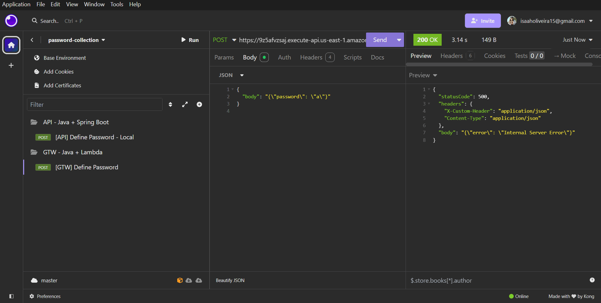
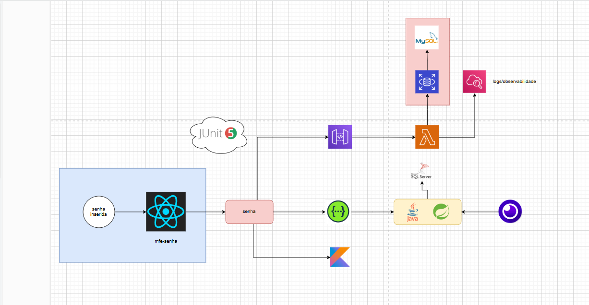

# password-api-lambda-itau

This project contains source code and supporting files for a serverless application that you can deploy with the SAM CLI. It includes the following files and folders.

- HelloWorldFunction/src/main - Code for the application's Lambda function.
- events - Invocation events that you can use to invoke the function.
- HelloWorldFunction/src/test - Unit tests for the application code. 
- template.yaml - A template that defines the application's AWS resources.

The application uses several AWS resources, including Lambda functions and an API Gateway API. These resources are defined in the `template.yaml` file in this project. You can update the template to add AWS resources through the same deployment process that updates your application code.

If you prefer to use an integrated development environment (IDE) to build and test your application, you can use the AWS Toolkit.  
The AWS Toolkit is an open source plug-in for popular IDEs that uses the SAM CLI to build and deploy serverless applications on AWS. The AWS Toolkit also adds a simplified step-through debugging experience for Lambda function code. See the following links to get started.

* [CLion](https://docs.aws.amazon.com/toolkit-for-jetbrains/latest/userguide/welcome.html)
* [GoLand](https://docs.aws.amazon.com/toolkit-for-jetbrains/latest/userguide/welcome.html)
* [IntelliJ](https://docs.aws.amazon.com/toolkit-for-jetbrains/latest/userguide/welcome.html)
* [WebStorm](https://docs.aws.amazon.com/toolkit-for-jetbrains/latest/userguide/welcome.html)
* [Rider](https://docs.aws.amazon.com/toolkit-for-jetbrains/latest/userguide/welcome.html)
* [PhpStorm](https://docs.aws.amazon.com/toolkit-for-jetbrains/latest/userguide/welcome.html)
* [PyCharm](https://docs.aws.amazon.com/toolkit-for-jetbrains/latest/userguide/welcome.html)
* [RubyMine](https://docs.aws.amazon.com/toolkit-for-jetbrains/latest/userguide/welcome.html)
* [DataGrip](https://docs.aws.amazon.com/toolkit-for-jetbrains/latest/userguide/welcome.html)
* [VS Code](https://docs.aws.amazon.com/toolkit-for-vscode/latest/userguide/welcome.html)
* [Visual Studio](https://docs.aws.amazon.com/toolkit-for-visual-studio/latest/user-guide/welcome.html)

## Deploy the sample application

The Serverless Application Model Command Line Interface (SAM CLI) is an extension of the AWS CLI that adds functionality for building and testing Lambda applications. It uses Docker to run your functions in an Amazon Linux environment that matches Lambda. It can also emulate your application's build environment and API.

To use the SAM CLI, you need the following tools.

* SAM CLI - [Install the SAM CLI](https://docs.aws.amazon.com/serverless-application-model/latest/developerguide/serverless-sam-cli-install.html)
* java17 - [Install the Java 17](https://docs.aws.amazon.com/corretto/latest/corretto-17-ug/downloads-list.html)
* Maven - [Install Maven](https://maven.apache.org/install.html)
* Docker - [Install Docker community edition](https://hub.docker.com/search/?type=edition&offering=community)

To build and deploy your application for the first time, run the following in your shell:

```bash
sam build
sam deploy --guided
```

The first command will build the source of your application. The second command will package and deploy your application to AWS, with a series of prompts:

* **Stack Name**: The name of the stack to deploy to CloudFormation. This should be unique to your account and region, and a good starting point would be something matching your project name.
* **AWS Region**: The AWS region you want to deploy your app to.
* **Confirm changes before deploy**: If set to yes, any change sets will be shown to you before execution for manual review. If set to no, the AWS SAM CLI will automatically deploy application changes.
* **Allow SAM CLI IAM role creation**: Many AWS SAM templates, including this example, create AWS IAM roles required for the AWS Lambda function(s) included to access AWS services. By default, these are scoped down to minimum required permissions. To deploy an AWS CloudFormation stack which creates or modifies IAM roles, the `CAPABILITY_IAM` value for `capabilities` must be provided. If permission isn't provided through this prompt, to deploy this example you must explicitly pass `--capabilities CAPABILITY_IAM` to the `sam deploy` command.
* **Save arguments to samconfig.toml**: If set to yes, your choices will be saved to a configuration file inside the project, so that in the future you can just re-run `sam deploy` without parameters to deploy changes to your application.

You can find your API Gateway Endpoint URL in the output values displayed after deployment.

## Use the SAM CLI to build and test locally

Build your application with the `sam build` command.

```bash
password-api-lambda-itau$ sam build
```

The SAM CLI installs dependencies defined in `HelloWorldFunction/pom.xml`, creates a deployment package, and saves it in the `.aws-sam/build` folder.

Test a single function by invoking it directly with a test event. An event is a JSON document that represents the input that the function receives from the event source. Test events are included in the `events` folder in this project.

Run functions locally and invoke them with the `sam local invoke` command.

```bash
password-api-lambda-itau$ sam local invoke HelloWorldFunction --event events/event.json
```

The SAM CLI can also emulate your application's API. Use the `sam local start-api` to run the API locally on port 3000.

```bash
password-api-lambda-itau$ sam local start-api
password-api-lambda-itau$ curl http://localhost:3000/
```

The SAM CLI reads the application template to determine the API's routes and the functions that they invoke. The `Events` property on each function's definition includes the route and method for each path.

```yaml
      Events:
        HelloWorld:
          Type: Api
          Properties:
            Path: /hello
            Method: get
```

## Add a resource to your application
The application template uses AWS Serverless Application Model (AWS SAM) to define application resources. AWS SAM is an extension of AWS CloudFormation with a simpler syntax for configuring common serverless application resources such as functions, triggers, and APIs. For resources not included in [the SAM specification](https://github.com/awslabs/serverless-application-model/blob/master/versions/2016-10-31.md), you can use standard [AWS CloudFormation](https://docs.aws.amazon.com/AWSCloudFormation/latest/UserGuide/aws-template-resource-type-ref.html) resource types.

## Fetch, tail, and filter Lambda function logs

To simplify troubleshooting, SAM CLI has a command called `sam logs`. `sam logs` lets you fetch logs generated by your deployed Lambda function from the command line. In addition to printing the logs on the terminal, this command has several nifty features to help you quickly find the bug.

`NOTE`: This command works for all AWS Lambda functions; not just the ones you deploy using SAM.

```bash
password-api-lambda-itau$ sam logs -n HelloWorldFunction --stack-name password-api-lambda-itau --tail
```

You can find more information and examples about filtering Lambda function logs in the [SAM CLI Documentation](https://docs.aws.amazon.com/serverless-application-model/latest/developerguide/serverless-sam-cli-logging.html).

## Unit tests

Tests are defined in the `HelloWorldFunction/src/test` folder in this project.

```bash
password-api-lambda-itau$ cd HelloWorldFunction
HelloWorldFunction$ mvn test
```

## Cleanup

To delete the sample application that you created, use the AWS CLI. Assuming you used your project name for the stack name, you can run the following:

```bash
sam delete --stack-name password-api-lambda-itau
```

## Resources

See the [AWS SAM developer guide](https://docs.aws.amazon.com/serverless-application-model/latest/developerguide/what-is-sam.html) for an introduction to SAM specification, the SAM CLI, and serverless application concepts.

Next, you can use AWS Serverless Application Repository to deploy ready to use Apps that go beyond hello world samples and learn how authors developed their applications: [AWS Serverless Application Repository main page](https://aws.amazon.com/serverless/serverlessrepo/)

---------------------------------------------------------------------------------

## Prerequisites

To run and deploy this Lambda project locally and on AWS, you will need to have the following tools installed:

**AWS CLI** - You can install the AWS CLI from the official documentation: Install the AWS CLI.

**SAM CLI** - The AWS Serverless Application Model (SAM) Command Line Interface (CLI) is an extension of the AWS CLI that simplifies the process of building and deploying serverless applications. You can install it by following the instructions here: Install the SAM CLI.

**Docker** - SAM uses Docker to simulate the AWS environment locally. You can install Docker here.

**Java 17** - The application uses Java, so you will need to install Java 17. Instructions can be found here.

**Maven** - This project uses Maven for building and managing dependencies. You can install Maven here.

## Setting Up IAM Credentials

To interact with AWS resources (like Lambda and API Gateway), you must set up an IAM user and configure the AWS CLI with the proper credentials. Follow these steps:

- Create a new IAM user:

1) Log in to the AWS Management Console.
2) Go to the IAM service and click on Users.
3) Click Add user.
4) Assign Programmatic access to allow access via AWS CLI and SDK.
5) Attach necessary policies such as AdministratorAccess or the minimal permissions needed for 6) Lambda and API Gateway.
7) Save the access keys and secret access keys for the IAM user. These will be used to configure the AWS CLI.

## Configure the AWS CLI:

Run the following command in your terminal to configure your AWS CLI:

```plaintext
  aws configure
```

Enter the Access Key ID, Secret Access Key, and region for your IAM user.

## Creating a New SAM Project

Initialize the SAM Project: Once the AWS CLI and SAM CLI are set up, run the following command to initialize a new SAM project:

```plaintext
  sam init
```

This will prompt you for several options. You can select the following based on your setup:

- Choose a template: Select 1 for a basic "Hello World" Lambda function.
- Runtime: Select java17 or whichever runtime you are using.
- Package type: Choose Zip for packaging your Lambda function.

## Deploy the Application:

To deploy your Lambda function for the first time, run the following commands


```plaintext
  sam build
  sam deploy --guided
```

During the deployment process, SAM will prompt you to provide configuration details:
- Stack Name: Provide a unique name for your stack (e.g., password-api-lambda-itau).
- AWS Region: Choose the region for deployment.
- Confirm changes before deploy: Set to "yes" to manually approve changes before deployment.
- Allow SAM CLI IAM role creation: Confirm that SAM can create IAM roles for the Lambda function.
- Save arguments to samconfig.toml: Save configuration for future deployments.
- After deployment, you will receive an API Gateway endpoint URL that you can use to invoke your Lambda function.

## Running the Application Locally

To test your Lambda function and API Gateway locally, use the SAM CLI to emulate the environment:

```plaintext
  sam build
```

## How can i test? 

You can test this lambda: 

1) AWS


2) API Gateway - Insomnia  


## DrawIO



